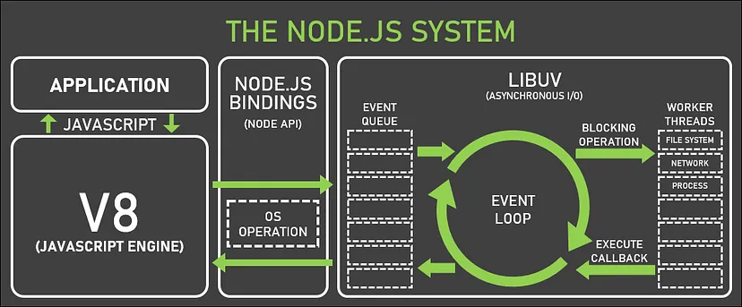
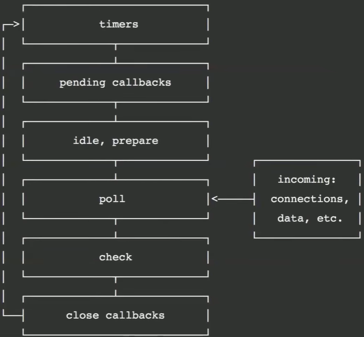

# 2. Node.js의 내부 구조의 핵심들



## 1) REPL(Read-Eval-Print-Loop)

- Node.js를 설치하면 기본적으로 제공되는 콘솔 환경. javascript 코드를 읽어서 평가하고 코드의 실행(V8 엔진이) 결과를 출력해주는 것을 반복해주는 환경이다.

## 2) libuv

[libuv 공식문서](https://libuv.org/)

- 이벤트 루프를 기반으로 하는 비동기 I/O에 대한 지원을 제공하는 다중 플랫폼 C 라이브러리
- OS 플랫폼을 추상화해주기 때문에 window, unix 계열의 환경에서 동일한 코드로 작업을 할 수 있음
- Node.js 환경에서의 `Event Loop`를 제공하여 비동기 처리를 가능하게 함
  - 기본적으로 Thread pool에서 4개의 Thread를 제공함
  - `File System` 작업의 경우 Thread pool에서 처리하고, `Network` 작업의 경우 OS에게 요청하여 처리함

## 3) Event loop

- 루프 자체는 싱글 스레드로 동작한다.
- 여러 단계(phase)로 구성되어 있으며, 각 단계는 `FIFO(First In First Out)`의 큐로 이루어져 있다.
- 각 phase 처리 시 루프는 잠시 멈춘다. (이벤트 루프의 각 단계는 동기적으로 처리된다.)

### (1) phase 구성



1. `Timers` : setTimeout(), setInterval()에 의해 예약된 콜백을 실행 -> `만료된 타이머의 콜백 실행`
2. `Pending Callbacks` : TCP 연결 지연 및 오류 유형과 같은 일부 시스템 작업에 대한 콜백을 실행
3. `Idle, Prepare` : 내부적인 작업 (이벤트루프는 아무 작업도 수행하지 않음)
4. `Poll` : 대부분의 I/O 작업 관련 콜백을 실행 -> `완료된 I/O 이벤트의 콜백(fs.readFile('test.txt', callback);의 callback) 실행`
  - 데이터베이스 관련 작업 완료 콜백
  - HTTP 요청 완료 콜백
  - 파일 비동기 읽기 완료 콜백
5. `Check` : setImmediate() 콜백을 실행
6. `Close Callbacks` : close()와 같은 종료 이벤트 처리

- 단계(phase)를 넘어가는 작업을 'Tick'이라고 부른다.
- 이벤트 루프의 각 실행 사이에 확인을 하게 되는데, phase의 모든 큐가 비고, 더 이상 예약된 타이머나 I/O 이벤트가 없으면 이벤트 루프가 종료된다.

### (2) Event loop에 대한 참고자료 및 예제코드

- [js의 이벤트 루프 동작은 이것만 봐도 이해가 된다 - InpaDev 블로그](https://inpa.tistory.com/entry/%F0%9F%94%84-%EC%9E%90%EB%B0%94%EC%8A%A4%ED%81%AC%EB%A6%BD%ED%8A%B8-%EC%9D%B4%EB%B2%A4%ED%8A%B8-%EB%A3%A8%ED%94%84-%EA%B5%AC%EC%A1%B0-%EB%8F%99%EC%9E%91-%EC%9B%90%EB%A6%AC)
- [이벤트루프와 poll phase에 대한 예제 코드](./poll_phase_test.js)

## 4) setTimeout, setImmediate, process.nextTick

- 해당 메서드들은 모두 비동기 작업으로 넘기는 코드들이다. 그러나 Event Loop의 동작에 따라 처리가 달라진다.

- [예제코드](./setTimeout_setImmediate_nextTick.js)

## 5) Event Emitter

- Node.js의 핵심 모듈(`events`)에서 제공되는 클래스로, 이벤트를 발생시키고 리스너(콜백 함수)를 실행하는 `이벤트 기반 비동기 처리`를 지원하는 객체이다.
- Node.js의 많은 모듈(e.g. http, fs 등)이 내부적으로 `Emitter`를 사용해 비동기 작업의 상태를 알린다.

```javascript
const EventEmitter = require('events');
const celebrity = new EventEmitter(); // 같은 celebrity 객체를 의존함

let eventName = 'update post';

celebrity.on(eventName, (args) => {
    console.log(`This ${args} post is so awesome!`);
});

celebrity.on(eventName, (args) => {
    console.log(`I like this post's ${args}!`);
});

console.log('update post!');
celebrity.emit(eventName, 'image');
console.log('emit finished!');

/** 실행결과
 * update post!
 * This image post is so awesome!
 * I like this post's image!
 * emit finished!
 */
```

- [추가 예제 코드](./event_emitter.js)

> **Pub-Sub과 다른가?**
> 
> 발행자와 구독자가 있으며 발행자가 이벤트를 발생시키고 구독자가 수신하는 형태는 비슷해보인다.
> 
> 그러나 `Pub-Sub`은 가운데 `브로커(Broker)`가 있어 `완전히 느슨한 결합(Loose Coupling)`이다. 즉, 발행자와 구독자는 서로를 전혀 모른다는 것이다.
> 
> 반면 `Emitter`는 발행자와 구독자가 같은 `Emitter` 인스턴스를 의존한다. 서로 객체 자체에 대한 의존성이 남아있는 `약한 결합(Weak Coupling)`이다.