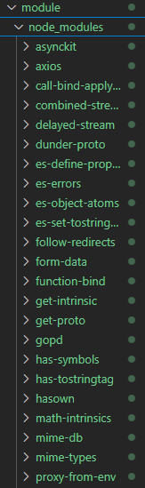

# 4. Node.js 패키지 관리

- [예제 디렉토리](../module/)

## 1) npm이란

- 오픈소스 Node.js 프로젝트 게시를 위한 온라인 리포지토리
- 패키지 설치, 버전 관리 및 종속성 관리를 지원하는 저장소와 상호작용 하기 위한 명령줄 유틸리티

## 2) 앱에 npm package 설치

### (1) 프로젝트 생성

`npm init -y` -> `package.json` 생성

```json
{
  "name": "module",
  "version": "1.0.0",
  "description": "",
  "main": "index.js",
  // 이 부분이 npm run {name} 부분
  "scripts": {
    "start": "node index.js", // production 에서는 `npm start`를 실행하게 되므로 devDependencies 모듈에 의존하지 않도록 주의해야함
    "test": "echo \"Error: no test specified\" && exit 1" // npm run test
  },
  "keywords": [],
  "author": "",
  "license": "ISC"
}
```

### (2) npm package 설치

`npm install {module_name}` -> `package.json`에 해당 내용 추가 -> node 모듈에서 사용 가능
- `npm install axios` 후 `package.json`
    ```json
    {
    "name": "module",
    "version": "1.0.0",
    "description": "",
    "main": "index.js",
    "scripts": {
        "test": "echo \"Error: no test specified\" && exit 1"
    },
    "keywords": [],
    "author": "",
    "license": "ISC",
    "dependencies": {
        "axios": "^1.8.4"
    }
    }
    ```


## 3) node_modules 폴더



- package.json에 있는 모듈(내가 직접 명시한 모듈) 및 그 하위 모듈이 들어있는 폴더

## 4) Semantic Versioning(SemVer)

```json
"dependencies": {
    "follow-redirects": "^1.16.0",
    "form-data": "^4.0.0",
    "proxy-from-env": "^1.1.0"
},
```

- node package들은 세 자리로 이루어져 있음
- `Major`.`Minor`.`Patch`
- `Major` - 변경되면 호환이 되지 않음
- `Minor` - 이전 버전과 호환되는 방식으로 기능을 추가함
- `Patch` - 버그 수정 시
- `~(틸드)` - Minor 버전까지 유지하고 Patch 범위에서만 자동으로 업데이트 함
    - `~0.0.1` == `0.0.1 <= x < 1.0.0`
    - `~0.1` == `0.1.0 <= x < 0.2.0`
- `^(캐럿)` - Major 버전까지 유지하고 Minor, Patch 범위에서 자동으로 업데이트 함
    - `^1.0.5` == `1.0.5 <= x < 2.0`
    - `^1.0` == `1.0.0 <= x < 2.0`
    - 버전이 1.0.0 미만인 경우는 ~(틸드) 처럼 Patch 범위에서만 업데이트 함
        - `^0.1.4` == `0.1.4 <= x < 0.2.0`
        - `^0.1` == `0.1.0 <= x < 0.2.0`
        - `^0.0.1` == `0.0.1`

## 5) package-lock.json

- `파일 생성 시점`의 node_modules의 의존성을 나타내는 정보 스냅샷
- 주 목적은 `동일한 종속성을 보장`하기 위함
    - package.json
        ```json
        "dependencies": {
            "follow-redirects": "^1.16.0", <-- 캐럿 표시
            "form-data": "^4.0.0",
            "proxy-from-env": "^1.1.0"
        }
        ```
    - package-lock.json
        ```json
        "form-data": {
            "version": "1.16.2", <-- (아마 실제 개발환경에서) 사용중인 버전
            ...
        }
        ```
    -> 이런 상황에서 모듈간 호환이 안되는 경우 버전 충돌이 있을 수 있음

## 6) npm audit

- `npm audit`
- 가진 의존성들의 취약점(vulnerabilities) 보고서 요청 (및 `fix 인자 추가` - 트리 반영)


## 7) npm install -g & npm install --save-dev

### (1) npm install -g

- 로컬 머신에 전역으로 패키지 추가
- 설치 예시 -> `npm install nodemon -g`
- 실행 예시 -> `$ nodemon index.js`
- 만약 전역이 아니라 프로젝트에만 추가했다면?
    - node_modules/.bin/nodemon 을 실행시켜야 함 -> `$ ./node_modules/.bin/nodemon index.js`

### (2) npm install --save-dev

- 프로젝트에 패키지를 추가하는데, 프로젝트 의존성이 아니라 개발환경 의존성으로 추가할 수 있음
- 배포 시 `npm install --production`을 하면 `devDependencies`는 추가하지 않음

- 프로젝트에 추가: `npm install nodemon`
    ```json
    "dependencies": {
        "axios": "^1.8.4",
        "nodemon": "^3.1.9"
    }
    ```
- 프로젝트 개발환경 추가: `npm install nodemon --save-dev`
    ```json
    "dependencies": {
        "axios": "^1.8.4"
    },
    "devDependencies": {
        "nodemon": "^3.1.9"
    }
    ```

## 8) yarn

- facebook에서 만든 패키지 관리 매니저. npm 단점들을 보완하기 위해 개발함 (속도 및 보안)
    - 속도 -> `패키지 병렬 설치`로 개선
    - 보안 -> 백그라운드 프로세스로 보안 검사 수행, 라이센스 정보를 사용하여 악성 스크립트 확인 및 종속성 충돌 검사
- `npm`은 node.js를 설치할 때 같이 설치됨
- 패키지 설치 시 lock 파일을 `npm`은 SHA-512를 사용하지만 `yarn`은 checksum으로 확인함.

> 현재는 npm도 많은 개선이 진행되어 보안 감사를 수행함

### (1) yarn 설치

- `npm install -g yarn`

### (2) yarn으로 패키지 설치

- 프로젝트에 `package.json` 사용
- `yarn install`

### (3) yarn.lock

- npm의 `package-lock.json` 과 동일한 역할

## 9) npm과 yarn 명령어 비교

| 기능            | npm 명령어                | yarn 명령어         |
|-----------------|--------------------------|--------------------|
| 기본 초기화     | `npm init`               | `yarn init`        |
| 자동 초기화     | `npm init -y`            | `yarn init -y`     |
| 일반 의존성 설치      | `npm install <package>`         | `yarn add <package>`    |
| 개발 의존성 설치      | `npm install --save-dev <package>` | `yarn add --dev <package>` |
| 글로벌 설치           | `npm install -g <package>`      | `yarn global add <package>` |
| 모든 의존성 설치      | `npm install`                   | `yarn install`          |
| 프로덕션 의존성만 설치 | `npm install --production`      | `yarn install --production` |
| 패키지 제거     | `npm uninstall <package>` | `yarn remove <package>` |
| 스크립트 실행   | `npm run <script>`       | `yarn <script>`     |
| 기본 스크립트   | `npm start` / `npm test` | `yarn start` / `yarn test` |
| 모든 패키지 업데이트  | `npm update`             | `yarn upgrade`      |
| 특정 패키지 업데이트  | `npm update <package>`   | `yarn upgrade <package>` |
| 설치된 패키지 목록    | `npm list`               | `yarn list`         |
| 특정 패키지 정보      | `npm info <package>`     | `yarn info <package>` |
| npm/yarn 버전 확인   | `npm -v`                 | `yarn -v`           |
| 캐시 정리       | `npm cache clean --force`| `yarn cache clean`  |
| 의존성 감사           | `npm audit`              | `yarn audit`        |
| 의존성 문제 해결      | `npm audit fix`          | `yarn upgrade`      |

> 한 프로젝트에서 `npm`과 `yarn`을 혼용하지 말 것!